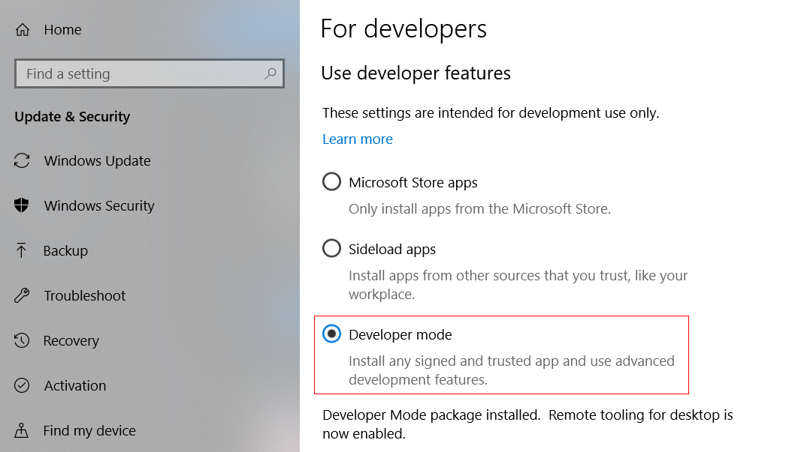
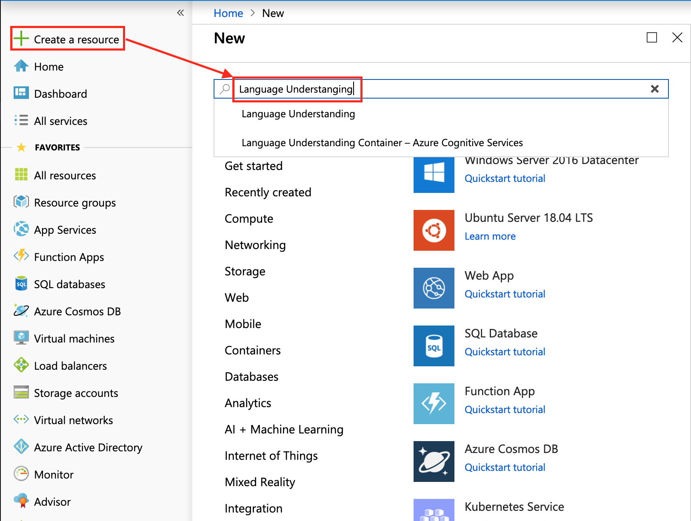

# Prerequisite
- PC
- VR/MR headset(or just a headset)

- Azure account [Sign up for Azure FREE trial](https://azure.microsoft.com/en-us/free/)

- SDK download [Windows 10 SDK 1809 Download](https://developer.microsoft.com/en-us/windows/downloads/windows-10-sdk)
- Unity(2017.4) installed
<br/>

## Access 'Mixed Reality' settings on Windows 10
1. Use the **Windows key + R** keyboard shortcut to open the **Run** command.<br/>
2. Type **regedit**, and click **OK** to open the **Registry**.<br/>
3. Browse the following path:<br/>
```HKEY_CURRENT_USER\Software\Microsoft\Windows\CurrentVersion\Holographic```<br/>

You will see the key **FirstRunSucceeded**, right click on it.<br/> 
5. Change the value data from **0** to **1**.<br/>

    **Quick Tip**: If you want to remove the "Mixed Reality" section from the Settings app, you can leave the **FirstRunSucceeded** key with the default value of **0**.<br/>
    Click **OK**. You can see 'Mixed reality' in Windows Settings.
    
6. Turn on the option *“When I wear my headset, switch to headset mic”* in the Mixed Reality Portal settings.
7. Check the box under Speech, "Use speech reognition in Windows Mixed Reality. Speech recognition will always listen when mixed reality is running.

8. To allow your machine to enable **Dictation, go to Windows Settings > Privacy > Speech, Inking & Typing** and press on the button **Turn On speech services and typing suggestions**.

## Enable Developer Mode





Choose a Resource Group or create a new one.<br/> 
A resource group provides a way to monitor, control access, provision and manage billing for a collection of Azure assets.<br/>
It is recommended to keep all the Azure services associated with a single project  under a common resource group.<br/>
Sign in Luis.ai with the same credential with MS Azure.<br/>


- *Intent*, represents the method that will be called following a query from the user. <br/>
- An *INTENT* may have one or more *ENTITIES*.<br/>
- *Entity*, is a component of the query that describes information relevant to the *INTENT*.<br/>
- *Utterances*, are examples of queries provided by the developer, that LUIS will use to train itself.<br/>
